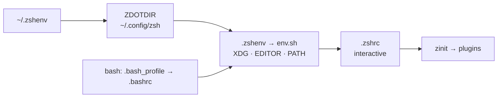

# dotfiles


My entire working environment, versioned and reproducible: one `./run install`
takes a fresh machine (**macOS** or **Fedora**) to a ready workstation.

<!-- TODO: screenshot — starship prompt + tmux status bar + `ll` output.
     Save as assets/preview.png, then:  -->

> [!WARNING]
> These are my settings. Read before you run.

## Highlights

- **POSIX sh installer** — idempotent (re-run = no-op), faithful `--dry-run`,
  timestamped restorable backups, honest exit codes. No framework.
- **Clean `$HOME`** — everything follows the [XDG Base Directory spec](https://specifications.freedesktop.org/basedir-spec/latest/);
  even legacy history files are migrated out on install.
- **No root required for the shell** — `~/.zshenv` bootstraps `ZDOTDIR`
  entirely from `$HOME`. `sudo` is only needed by the package layer: the
  initial Homebrew install on macOS, `dnf` on Fedora, and `/etc/shells`.
- **Degrades cleanly** — no network, no git, a missing tool: the shell still
  starts. Scripts stay silent; an interactive shell gets a single stderr
  line, never a blocked startup.
- **Tooling as authority** — shellcheck and shfmt are installed by the repo
  and enforced by it (`.editorconfig`, CI).

## How it works



Details, load order and design decisions: [docs/architecture.md](docs/architecture.md).

## Quick start

Optional first step — so the very first commit already signs: with the
YubiKey plugged in, retrieve the resident signing key (`ssh-keygen -K`,
then rename the retrieved `*_signing` pair to `~/.ssh/id_signing_sk` /
`.pub`). Skipping it costs nothing: run `./run install gitsign` once the
key is in place.

```sh
git clone --recurse-submodules git@github.com:Raf7c/dotfiles.git ~/.dotfiles
cd ~/.dotfiles
./run install          # idempotent; preview first with: ./run install -n
```

## Commands

```sh
./run install     # everything -> ready (idempotent)
./run update      # git pull + resync links, packages, runtimes, submodules
./run upgrade     # bump versions (brew/dnf, mise, zinit, TPM, submodules)
```

Options: `-n`/`--dry-run`, `-y`/`--yes`, `-h`/`--help`.
Single modules: `./run install symlinks packages`.

## Documentation

| Page | Contents |
|---|---|
| [architecture.md](docs/architecture.md) | startup chains, XDG layout, bootstrap without root, plugin policy |
| [installer.md](docs/installer.md) | how `run` works, step contract, backups |
| [keymaps.md](docs/keymaps.md) | every binding: zsh vi-mode, fzf, aliases |
| [tools.md](docs/tools.md) | each CLI tool and why it is there |
| [terminals.md](docs/terminals.md) | ghostty and kitty, fonts, themes |
| [tmux](.config/tmux/README.md) | everything tmux: bindings, theme, plugins — lives with its config |
| [git](.config/git/README.md) | config.local mechanics, FIDO2 signing, aliases, notable defaults |

Maintenance convention: documentation is fixed in the same commit as the
code it describes.

## Uninstall

Symlinks point into this repo — removing the repo leaves dead links to
delete at your convenience. Backups live in
`~/.local/state/dotfiles/backups/<ts>/`.

What an install leaves beyond `$HOME`, honestly: the login shell (`chsh -s
/bin/bash` reverts it, `/etc/shells` keeps one line), Homebrew and its
packages on macOS, the dnf packages on Fedora — and, back inside
`$HOME`, binaries in `~/.local/bin` that no package manager owns:
claude on macOS (mise and starship come from brew there); all three on
Fedora. `packages` is the only module
that needs sudo — a root-free install is
`./run install symlinks directories gitsign plugins`.

## License

[MIT](LICENSE).
