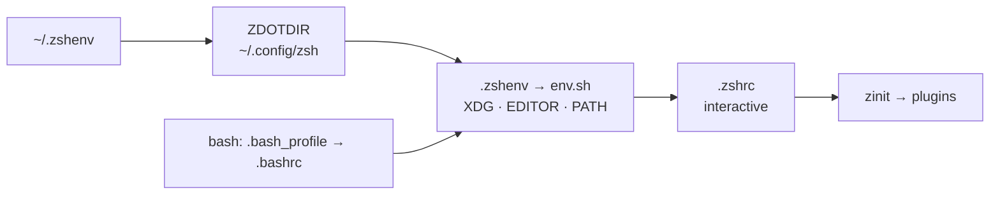

# dotfiles


[](https://github.com/Raf7c/dotfiles/actions/workflows/ci.yml)


My entire working environment, versioned and reproducible: one `./run install`
takes a fresh machine (**macOS** or **Fedora**) to a ready workstation.

<!-- TODO: screenshot: starship prompt, tmux status bar, `ll` output.
     Save as assets/preview.png, then:  -->

> [!WARNING]
> These are my settings. Read before you run.

## Requirements

- **macOS** or **Fedora**. The installer refuses an unknown OS.
- `git`, `curl`, and an SSH key registered on GitHub (the clone uses `git@`).
- `sudo` for three steps only (`prereqs`, `packages`, `shell`); everything
  else stays in `$HOME`.

## Stack

- **Shell**: zsh (login shell) · bash
- **Prompt**: starship
- **Runtimes**: mise
- **Theme**: Catppuccin, auto light/dark
- **Terminals**: ghostty · kitty
- **Multiplexer**: tmux
- **Editors**: nvim · vim (fallback) · JetBrains

## Highlights

- **POSIX sh installer**, idempotent (a second run does nothing), with a
  faithful `--dry-run`, timestamped restorable backups and honest exit
  codes. No framework.
- **Clean `$HOME`**: everything follows the [XDG Base Directory spec](https://specifications.freedesktop.org/basedir-spec/latest/);
  even legacy history files are migrated out on install.
- **No root required for the shell.** `~/.zshenv` bootstraps `ZDOTDIR`
  entirely from `$HOME`, so the startup chain never depends on root.
  Installing does ask for `sudo` three times: the initial Homebrew install
  on macOS, `dnf` on Fedora, and the `/etc/shells` line.
- **Degrades cleanly.** No network, no git, a missing tool: the shell still
  starts. Scripts stay silent; an interactive shell gets a single stderr
  line, never a blocked startup.
- **Tooling as authority**: shellcheck and shfmt are version-pinned by the
  repo and enforced by it (`.editorconfig`, CI).

## Non-goals

No framework and no plugin manager for the installer: eleven steps of POSIX
sh are easier to audit than a dependency. No system-wide or multi-user
install: everything lives in `$HOME` except the package layer. No
Windows, no WSL: untested, therefore unclaimed.

## How it works



Details, load order and design decisions: [docs/architecture.md](docs/architecture.md).

## Repo layout

```text
run                  the installer: arguments, step dispatch
setup/               its guts: manifest (links, dirs, migrations), lib, steps
scripts/             manual scripts, on the PATH, never run by ./run
docs/                architecture, installer, maintenance, usage, packages, tools, terminals
.config/             everything linked into ~/.config (zsh, tmux, git, kitty…)
.zshenv .bashrc .bash_profile    the three files zsh and bash need in $HOME
.vimrc                           four options for the fallback vim: tabs, width 4
.editorconfig .yamllint.yml      formatting authorities, read by the CI
.github/             CI workflow + Dependabot
```

Inside `setup/`: [docs/installer.md](docs/installer.md).

## Quick start

```sh
git clone --recurse-submodules git@github.com:Raf7c/dotfiles.git ~/.dotfiles
cd ~/.dotfiles
./run install          # idempotent; preview first with: ./run install -n
exec zsh               # new login shell, with the installed tools on PATH
```

Identity first, before any commit: `user.name` and `user.email` live in
`.config/git/config`, versioned on purpose: one person, several machines,
one edit. Change them if you are not me, and keep the principal in
`.config/git/allowed_signers` on that same email, or signature
verification will not match.

Commit signing comes after the install, on purpose: on macOS it is the
install that brings the openssh able to talk to a FIDO2 key (Apple's
cannot; Fedora's stock one already can). With the YubiKey plugged in:

```sh
cd ~/.ssh && ssh-keygen -K                       # pulls BOTH resident credentials
mv id_ed25519_sk_rk_github      github_sk        # push / authentication
mv id_ed25519_sk_rk_github.pub  github_sk.pub
mv id_ed25519_sk_rk_signing     id_signing_sk    # commit signing
mv id_ed25519_sk_rk_signing.pub id_signing_sk.pub
chmod 600 github_sk id_signing_sk && chmod 644 github_sk.pub id_signing_sk.pub

cd ~/.dotfiles && ./run install gitsign          # signing enabled from now on
```

`github_sk` is not a default key name: `~/.ssh/config` has to point at it
(that file lives in a separate private repo). `id_signing_sk` needs no
wiring, being exactly the file `gitsign` looks for.

No YubiKey on this machine? Skip that second block: `gitsign` leaves
signing disabled when it finds no key, and nothing else changes. Creating
the keys from scratch: [git](.config/git/README.md).

## Commands

```sh
./run install     # everything -> ready (idempotent)
./run update      # git pull + resync links, packages, runtimes, submodules
./run upgrade     # bump versions (brew/dnf, mise, zinit, TPM, submodules)
```

Options: `-n`/`--dry-run`, `-y`/`--yes`, `-h`/`--help`.
Single steps: `./run install symlinks packages`.
Root-free install (skips the three steps that need sudo):
`./run install submodules directories migrate symlinks gitsign runtimes plugins`.

## Documentation

| Page | Contents |
|---|---|
| [architecture.md](docs/architecture.md) | startup chains, XDG layout, bootstrap without root, plugin policy |
| [installer.md](docs/installer.md) | how `run` works, step contract, backups |
| [usage.md](docs/usage.md) | everything you type: zsh vi-mode, fzf, fzf-git, aliases |
| [packages.md](docs/packages.md) | where each tool comes from on each OS, and what is left by hand |
| [tools.md](docs/tools.md) | why each tool is here, and what it replaces |
| [terminals.md](docs/terminals.md) | ghostty and kitty, fonts, themes |
| [maintenance.md](docs/maintenance.md) | what the CI checks, and what to do when something breaks |
| [tmux](.config/tmux/README.md) | everything tmux: bindings, theme, plugins (lives with its config) |
| [git](.config/git/README.md) | config.local mechanics, FIDO2 signing, aliases, notable defaults |

Two of these live **next to their config** rather than in `docs/`: tmux
and git carry mechanics that are not obvious from reading the files, so
the explanation sits where the files are. Everything a machine-wide
concern goes to `docs/`.

Maintenance convention: documentation is fixed in the same commit as the
code it describes. The CI and the troubleshooting table live in
[maintenance.md](docs/maintenance.md).

## License

[MIT](LICENSE).
