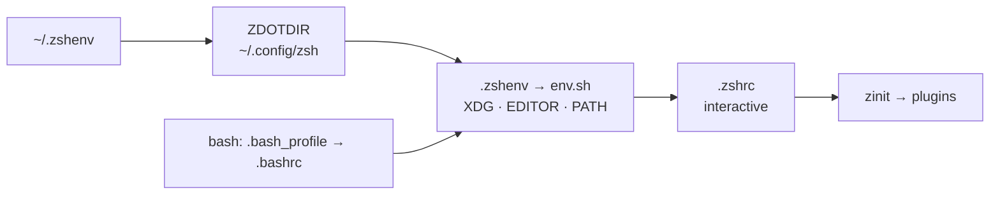

# dotfiles


[](https://github.com/Raf7c/dotfiles/actions/workflows/ci.yml)


My entire working environment, versioned and reproducible: one `./run install`
takes a fresh machine (**macOS** or **Fedora**) to a ready workstation.

<!-- TODO: screenshot — starship prompt + tmux status bar + `ll` output.
     Save as assets/preview.png, then:  -->

> [!WARNING]
> These are my settings. Read before you run.

## Requirements

- **macOS** or **Fedora** — the installer refuses an unknown OS.
- `git`, `curl`, and an SSH key registered on GitHub (the clone uses `git@`).
- `sudo` for the `packages` module only; everything else stays in `$HOME`.

## Highlights

- **POSIX sh installer** — idempotent (re-run = no-op), faithful `--dry-run`,
  timestamped restorable backups, honest exit codes. No framework.
- **Clean `$HOME`** — everything follows the [XDG Base Directory spec](https://specifications.freedesktop.org/basedir-spec/latest/);
  even legacy history files are migrated out on install.
- **No root required for the shell** — `~/.zshenv` bootstraps `ZDOTDIR`
  entirely from `$HOME`. `sudo` is only needed by the package layer: the
  initial Homebrew install on macOS, `dnf` on Fedora, and `/etc/shells`.
- **Degrades cleanly** — no network, no git, a missing tool: the shell still
  starts. Scripts stay silent; an interactive shell gets a single stderr
  line, never a blocked startup.
- **Tooling as authority** — shellcheck and shfmt are version-pinned by the
  repo and enforced by it (`.editorconfig`, CI).

## How it works



Details, load order and design decisions: [docs/architecture.md](docs/architecture.md).

## Quick start

```sh
git clone --recurse-submodules git@github.com:Raf7c/dotfiles.git ~/.dotfiles
cd ~/.dotfiles
./run install          # idempotent; preview first with: ./run install -n
exec zsh               # new login shell, with the installed tools on PATH
```

Commit signing comes after the install, on purpose: on macOS it is the
install that brings the openssh able to talk to a FIDO2 key (Apple's
cannot; Fedora's stock one already can). With the YubiKey plugged in:

```sh
cd ~/.ssh && ssh-keygen -K                       # pulls BOTH resident credentials
mv id_ed25519_sk_rk_github      github_sk        # push / authentication
mv id_ed25519_sk_rk_github.pub  github_sk.pub
mv id_ed25519_sk_rk_signing     id_signing_sk    # commit signing
mv id_ed25519_sk_rk_signing.pub id_signing_sk.pub
chmod 600 github_sk id_signing_sk

cd ~/.dotfiles && ./run install gitsign          # signing enabled from now on
```

`github_sk` is not a default key name: `~/.ssh/config` has to point at it
(that file lives in a separate private repo). `id_signing_sk` needs no
wiring — it is exactly the file `gitsign` looks for.

No YubiKey on this machine? Skip that second block: `gitsign` leaves
signing disabled when it finds no key, and nothing else changes. Creating
the keys from scratch: [git](.config/git/README.md).

## Commands

```sh
./run install     # everything -> ready (idempotent)
./run update      # git pull + resync links, packages, runtimes, submodules
./run upgrade     # bump versions (brew/dnf, mise, zinit, TPM, submodules)
```

Options: `-n`/`--dry-run`, `-y`/`--yes`, `-h`/`--help`.
Single modules: `./run install symlinks packages`.
Root-free install (skips the only module that needs sudo):
`./run install symlinks directories gitsign plugins`.

## Documentation

| Page | Contents |
|---|---|
| [architecture.md](docs/architecture.md) | startup chains, XDG layout, bootstrap without root, plugin policy |
| [installer.md](docs/installer.md) | how `run` works, step contract, backups |
| [keymaps.md](docs/keymaps.md) | every binding: zsh vi-mode, fzf, fzf-git, aliases |
| [tools.md](docs/tools.md) | every tool, and which OS gets it from where |
| [terminals.md](docs/terminals.md) | ghostty and kitty, fonts, themes |
| [tmux](.config/tmux/README.md) | everything tmux: bindings, theme, plugins — lives with its config |
| [git](.config/git/README.md) | config.local mechanics, FIDO2 signing, aliases, notable defaults |

Maintenance convention: documentation is fixed in the same commit as the
code it describes.

## License

[MIT](LICENSE).
