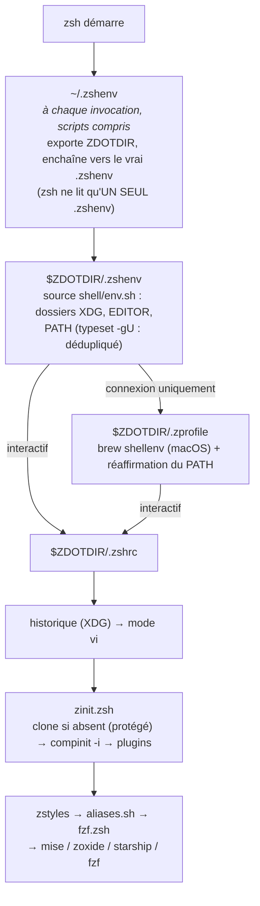
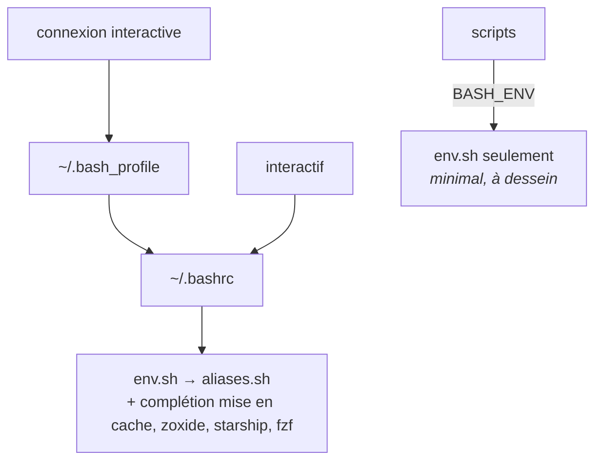

# Architecture

Comment un shell passe de « le processus démarre » à « prompt prêt ».

## L'essentiel

| Question | Réponse |
|---|---|
| Où commence zsh ? | `~/.zshenv`, qui exporte `ZDOTDIR` puis passe la main |
| Qu'est-ce qui est partagé entre zsh et bash ? | `shell/env.sh`, en POSIX |
| Faut-il root ? | **non**, jamais, rien hors de `$HOME` |
| Où vivent les fichiers ? | sous XDG, sauf quatre fichiers d'entrée dans `$HOME` |
| Qui a le dernier mot sur le `PATH` ? | la dernière ligne de `.zshrc` |

## Démarrage de zsh



## Démarrage de bash



`env.sh` est la source unique de vérité des deux shells : syntaxe POSIX, sourcé
exactement une fois par shell.

`zinit.zsh` clone zinit au premier démarrage. C'est protégé : pas de git ou pas
de réseau donne un shell dégradé, jamais une erreur au démarrage.

## Aucun root

`~/.zshenv`, lié depuis ce dépôt, est le seul bootstrap de `ZDOTDIR`. Rien dans
la chaîne de démarrage ne vit hors de `$HOME`. Retirer sudo d'une machine déjà
installée ne change rien au comportement du shell.

<details>
<summary>Pourquoi pas `/etc/zshenv`, et ce que l'installation demande</summary>

`/etc/zshenv` coûterait trois choses : toute la configuration zsh dépendrait de
root, le bloc déborderait dans le shell des autres utilisateurs, et `zsh -f`
cesserait d'être vierge puisque `/etc/zshenv` est lu même là.

L'installation est un autre moment. Deux étapes demandent sudo, pour deux
raisons différentes : `prereqs`, parce que l'installeur Homebrew le réclame
lui-même, et `shell`, qui est le **seul** endroit où ce dépôt écrit `sudo` —
pour ajouter le zsh de Homebrew à `/etc/shells`, et seulement s'il n'y figure
pas ([installer.md](installer.md)). `chsh` demande le mot de passe du compte,
pas sudo.

La différence est la durée de vie. Ces gestes ont lieu une fois, sur une
machine où l'on est admin et après confirmation. Un fichier système, lui,
serait relu à chaque démarrage de shell et pour chaque utilisateur.

</details>

## Organisation XDG

`$HOME` ne porte que quatre fichiers d'entrée : `.zshenv`, `.vimrc`, `.bashrc`,
`.bash_profile`. Plus les liens `~/.config`.

| Chemin | Contenu |
|---|---|
| `~/.config/*` | liens vers ce dépôt (voir `setup/manifest.sh`) |
| `~/.local/state` | historiques de shell, backups |
| `~/.cache` | dumps de compinit, caches de complétion |
| `~/.local/share` | zinit, mise, historique python, sessions tmux, ansible |

Les outils tiers qui ignorent la spécification gardent leurs dotdirs. `env.sh`
redirige les quelques-uns qui l'acceptent (`ANSIBLE_HOME`, `npm_config_cache`).

Chaque lecture d'un `XDG_*` hors de `env.sh` porte son défaut `:-`, pour que
chaque fichier survive à un chargement sans l'environnement partagé.

## Qui touche au PATH

Six acteurs, dans cet ordre :

| # | Acteur | Ce qu'il fait |
|---|---|---|
| 1 | `env.sh` | préfixe `~/.local/bin`, `~/.config/scripts`, les shims de mise |
| 2 | `$ZDOTDIR/.zshenv` | dédoublonne (`typeset -gU`), jette les entrées absentes |
| 3 | `/etc/zprofile` | lance `path_helper`, qui remet `/usr/bin` en tête |
| 4 | `.zprofile` | rejoue le point 2, après `brew shellenv` et après `path_helper` |
| 5 | zinit | préfixe son `polaris/bin` ; `.zshrc` rejoue le point 2 juste après |
| 6 | `.bashrc` | dédoublonne en awk : bash n'a pas `typeset -U` |

Les shims de mise doivent finir **en premier**.

```sh
zsh -lic 'print -l $path'
```

Le `-l` est obligatoire : sans lui `/etc/zprofile` n'est pas lu, `path_helper`
n'entre jamais en scène, et le contrôle ne voit pas ce qu'il doit vérifier.

<details>
<summary>Pourquoi chacun est là</summary>

**1.** Les shims de mise se retrouvent en premier : le runtime épinglé d'un
projet doit l'emporter sur ce que l'OS livre. `env.sh` *ajoute* aussi en fin
les lanceurs JetBrains, un extra qui ne doit jamais masquer un vrai outil.

**3.** zsh lit `/etc/zprofile` **lui-même** dans un shell de connexion, car
rien ici ne pose `unsetopt GLOBAL_RCS`. `path_helper` ne complète pas le
`PATH`, il le **reconstruit** : `/etc/paths` et `/etc/paths.d/*` passent en
tête, le reste derrière. C'est le seul acteur de cette liste que le dépôt ne
contrôle pas.

**4.** Homebrew préfixe `/opt/homebrew/bin`, qui sinon se placerait devant les
shims de mise et donnerait le node de brew au lieu de celui qui est épinglé.
Rejouer la fonction reprend la main sur Homebrew **et** sur `path_helper`.

**5.** zinit est le dernier à parler, donc sans rien d'autre c'est lui qui
gagnerait. Mesuré : `polaris/bin` arrive devant les shims de mise. Il est vide
aujourd'hui, et ce n'est pas le sujet : le dernier mot sur le `PATH` ne doit
pas appartenir à un clone tiers qui suit HEAD.

**6.** `mise activate --shims` re-préfixe un répertoire que le `PATH` hérité
portait déjà.

</details>

## Historique

Les deux shells écrivent sous XDG et gardent 100k entrées.

| | zsh | bash |
|---|---|---|
| fichier | `~/.local/state/zsh/history` | `~/.local/state/bash/history` |
| partagé entre sessions | `SHARE_HISTORY` | `history -a` dans `PROMPT_COMMAND` |
| doublons | `HIST_IGNORE_DUPS`, `HIST_EXPIRE_DUPS_FIRST`, `HIST_FIND_NO_DUPS` | `HISTCONTROL=ignoreboth:erasedups` |
| une espace en tête cache la commande | `HIST_IGNORE_SPACE` | `ignoreboth` |

> [!CAUTION]
> `EXTENDED_HISTORY` doit être posé **avant** la première écriture du fichier.
> L'activer plus tard laisse un historique à moitié formaté.

Le répertoire doit exister, sinon zsh cesse silencieusement d'enregistrer.
C'est à ça que sert l'étape `directories`.

## Complétion

`compinit -i` est lancé depuis `zinit.zsh`, avec un dump indexé par **hôte et
version de zsh**. Le dump n'est reconstruit que s'il a plus d'un jour.

<details>
<summary>Le nommage du dump, et trois comportements à connaître</summary>

`zcompdump-$HOST-$ZSH_VERSION` : un `$HOME` partagé par NFS, ou une montée de
version de zsh, ne doit jamais réutiliser un dump incompatible.

`-i` saute le prompt « insecure directories », parce qu'une question au
démarrage du shell est un shell cassé.

- la correspondance est insensible à la casse dans un seul sens
  (`m:{a-z}={A-Za-z}`) : une saisie en minuscules matche l'un ou l'autre ;
- le menu est dessiné par **fzf-tab**, d'où `menu no` : zsh ne doit pas ouvrir
  le sien ;
- les couleurs viennent de `dircolors` quand il existe. Sans lui, la liste est
  monochrome, rien de plus.

</details>

## Code tiers

[zinit](https://github.com/zdharma-continuum/zinit),
[TPM](https://github.com/tmux-plugins/tpm) et leurs plugins sont clonés depuis
GitHub **à HEAD**, et sourcés par chaque shell interactif.

| Plugin zsh | Rôle |
|---|---|
| [fzf-tab](https://github.com/Aloxaf/fzf-tab) | le menu de complétion Tab passe par fzf |
| [zsh-completions](https://github.com/zsh-users/zsh-completions) | définitions supplémentaires |
| [fzf-git.sh](https://github.com/junegunn/fzf-git.sh) | sélecteurs `Ctrl-G` sur les objets git |
| [zsh-syntax-highlighting](https://github.com/zsh-users/zsh-syntax-highlighting) | coloration de la ligne de commande |
| [zsh-autosuggestions](https://github.com/zsh-users/zsh-autosuggestions) | suggestion en gris issue de l'historique |

Plugins tmux : [.config/tmux/README.md](../.config/tmux/README.md).

<details>
<summary>Pourquoi ils ne sont pas épinglés, alors que la CI épingle des SHA</summary>

Un épinglage sur SHA complet protège contre la mutation d'un tag. C'est le
vecteur réellement observé : des tags existants repointés vers un commit
malveillant.

Mais l'écosystème zsh n'a aucun outillage de montée de version. Des épinglages
écrits à la main se périment, puis sont montés sans revue de toute façon.

L'exposition reste limitée à une installation fraîche ou à `./run upgrade`,
tous deux déclenchés par l'utilisateur.

Les GitHub Actions sont le cas inverse : un outillage de montée de version y
existe (Dependabot), donc la CI épingle des SHA de commit complets.

</details>

<details>
<summary>Lister ce qu'une machine exécute réellement, orphelins compris</summary>

```sh
for d in "${XDG_DATA_HOME:-$HOME/.local/share}"/zinit/plugins/*/ \
         "${XDG_CONFIG_HOME:-$HOME/.config}"/tmux/plugins/*/; do
  [ -d "$d/.git" ] || continue
  name=${d%/}; name=${name##*/}
  ref=$(git -C "$d" rev-parse --short HEAD 2>/dev/null || echo '?')
  flag=''
  case "$name" in
    _local---zinit | tpm) ;;
    *---*) grep -q -- "${name%%---*}/${name#*---}" \
        "${XDG_CONFIG_HOME:-$HOME/.config}/zsh/zinit.zsh" || flag=' <- ORPHAN' ;;
    *) grep -q -- "$name" \
        "${XDG_CONFIG_HOME:-$HOME/.config}/tmux/tmux.conf" || flag=' <- ORPHAN' ;;
  esac
  printf '%-45s %s%s\n' "$name" "$ref" "$flag"
done
```

</details>

## Variables qui portent au-delà du dépôt

| Variable | Effet |
|---|---|
| `BASH_ENV` → `env.sh` | tout bash non interactif lancé depuis ces shells hérite du PATH et de XDG |
| `NO_COLOR` | éteint les couleurs de l'installeur (`setup/lib/log.sh`) |

`BASH_ENV` est exportée par `.bashrc`, donc une tâche cron ou une unité systemd
ne la voit pas. Coût : une lecture de fichier par script.

---

Voir aussi : [installer.md](installer.md) pour la façon dont ces chaînes se
mettent en place, et [usage.md](usage.md) pour ce que le shell offre une fois
démarré.
