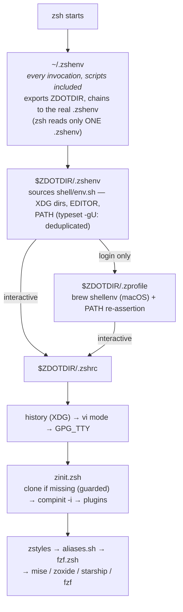
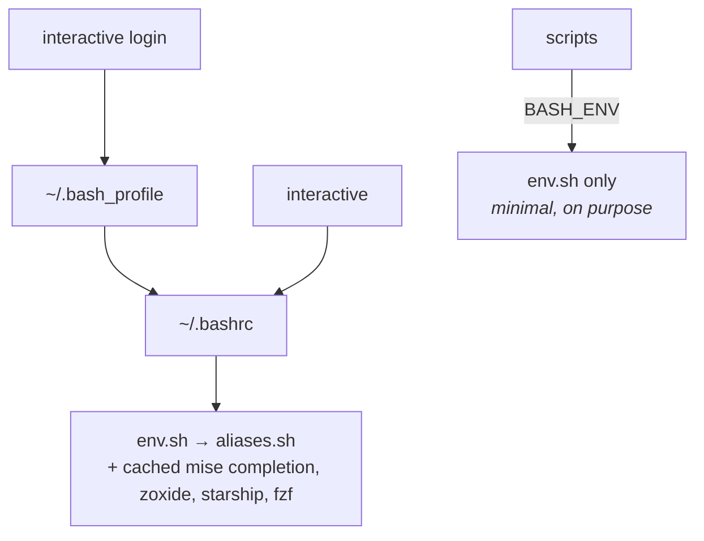

# Architecture

How a shell goes from "process starts" to "prompt ready", and the decisions
behind it. Verified by execution — these chains were traced, not guessed.

## zsh startup



`zinit.zsh` clones zinit on first start (guarded: no git or no network =
degraded shell, zero startup error), runs `compinit -i` with a dump named
after host and zsh version, then loads the plugins.

## bash startup



`env.sh` is the single source of truth shared by both shells: POSIX syntax,
sourced exactly once per shell.

## Why the bootstrap needs no root

`ZDOTDIR` used to be set from `/etc/zshenv` (written with sudo). Three
flaws: the whole zsh config depended on root, the block leaked into every
other user's shell, and `/etc/zshenv` is read even by `zsh -f`, so a
"pristine" shell never was. `~/.zshenv`, linked from this repo by the
symlinks step, is now the only bootstrap — `$HOME` only, no privilege.

## XDG layout

`$HOME` holds only four entry files (`.zshenv`, `.bashrc`, `.bash_profile`,
and the `~/.config` links). Everything else **this repo controls** lives
under XDG — third-party tools that ignore the spec keep their own
dotdirs, and `env.sh` redirects the few that accept it (`ANSIBLE_HOME`,
`npm_config_cache`):

| Path | Contents |
|---|---|
| `~/.config/*` | symlinks into this repo (see `setup/manifest.sh`) |
| `~/.local/state` | shell histories, backups |
| `~/.cache` | compinit dumps, completion caches |
| `~/.local/share` | zinit, mise, python history |

Every `XDG_*` read outside `env.sh` carries its `:-` default: each file
must survive being loaded without the shared environment.

## Third-party code policy

[zinit](https://github.com/zdharma-continuum/zinit),
[TPM](https://github.com/tmux-plugins/tpm) and their plugins are cloned
from GitHub at HEAD and sourced by every interactive shell.

The zsh plugins loaded (tmux plugins: see
[.config/tmux/README.md](../.config/tmux/README.md)):

| Plugin | Role |
|---|---|
| [fzf-tab](https://github.com/Aloxaf/fzf-tab) | the Tab completion menu goes through fzf |
| [zsh-completions](https://github.com/zsh-users/zsh-completions) | extra completion definitions |
| [fzf-git.sh](https://github.com/junegunn/fzf-git.sh) | `Ctrl-G` pickers over git objects (`wait lucid`, loaded only when fzf is present) |
| [zsh-syntax-highlighting](https://github.com/zsh-users/zsh-syntax-highlighting) | command-line colouring (loaded `wait lucid`: after the prompt) |
| [zsh-autosuggestions](https://github.com/zsh-users/zsh-autosuggestions) | greyed-out suggestion from history (`wait lucid` too) |

They are **unpinned on purpose**, with the argument stated precisely: a
full-SHA pin protects against tag mutation (the real-world vector —
existing tags repointed at a malicious commit), but the zsh ecosystem has
no bump tooling, so hand-written pins go stale and then get bumped without
review anyway. Exposure stays limited to a fresh install or
`./run upgrade`, both user-triggered. GitHub Actions are the opposite
case — bump tooling exists (Dependabot) — so the CI pins full commit SHAs.

To see what a machine actually runs, and spot clones still on disk but no
longer declared:

```sh
for d in "${XDG_DATA_HOME:-$HOME/.local/share}"/zinit/plugins/*/ \
         "${XDG_CONFIG_HOME:-$HOME/.config}"/tmux/plugins/*/; do
  [ -d "$d/.git" ] || continue
  name=${d%/}; name=${name##*/}
  ref=$(git -C "$d" rev-parse --short HEAD 2>/dev/null || echo '?')
  flag=''
  case "$name" in
    _local---zinit | tpm) ;;
    *---*) grep -q -- "${name%%---*}/${name#*---}" \
        "${XDG_CONFIG_HOME:-$HOME/.config}/zsh/zinit.zsh" || flag=' <- ORPHAN' ;;
    *) grep -q -- "$name" \
        "${XDG_CONFIG_HOME:-$HOME/.config}/tmux/tmux.conf" || flag=' <- ORPHAN' ;;
  esac
  printf '%-45s %s%s\n' "$name" "$ref" "$flag"
done
```

## Environment variables reaching beyond the repo

- **`BASH_ENV`** → `env.sh`: every non-interactive bash on the machine
  inherits the same PATH and XDG variables. Cost: one file read per script.
- **`NO_COLOR`**: turns off every installer colour (`setup/lib/log.sh`).

---

See also: [installer.md](installer.md) — how these chains get set up ·
[keymaps.md](keymaps.md) — what the interactive shell offers once started.
